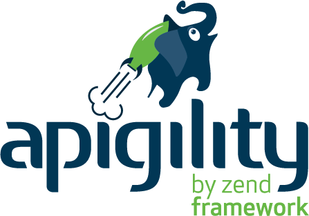

.. Note: Book data from http://www.theguardian.com/news/datablog/2011/jan/01/top-100-books-of-all-time#data

.. ===========================================================================
.. Change page
.. raw:: pdf

    PageBreak titlePage

.. class:: centredtitle

Apigility in action

.. ===========================================================================
.. Change page
.. raw:: pdf

    PageBreak standardPage

Exercise 1: Build a ping API
============================

Starting with the code in /exercise1, create an RPC ping service. Prove that it works using curl

Things to note:
---------------

* Turn on development mode
* Run the built-in webserver:
  ``php -S 0.0.0.0:8080 public/index.php``

.. class:: handout
    
    Time to complete: 15 mins

.. Change page
.. raw:: pdf

    PageBreak titlePage

.. class:: centredtitle

Obstacles to a good API

.. new standard page
.. raw:: pdf

    PageBreak standardPage

API considerations
==================

* Content negotiation
* HTTP method negotiation
* Error reporting
* Versioning
* Discovery
  

.. class:: note

    * Content negotiation: The client tells you what formats they can handle; what if you cannot honour any of them? Or what happens if the client submits data you cannot parse? How do you communicate these problems?
    * HTTP method negotiation: What do you do if the request is to an HTTP method you don't support? How do you communicate the error? How do you communicate what methods are allowed?
    * Error reporting: Set correct HTTP status codes. How to communicate the details?
    * Versioning: What happens when you want to make changes to your API? How will that impact existing users? How will you expose versions - via URI? via mediatype?
    * Discovery and documentation: How do users of your API know what services are available? RPC often has built-in mechanisms for this, but restricts you in other ways.  REST has no single, documented way of exposing available endpoints, but <i>does</i> expect that you provide relational links when appropriate.

Other considerations
====================

* Validation
* Authentication
* Authorisation
* Documentation

  
.. class:: note

    * Validation: What happens if the client sends you invalid data? How do you report the errors back to the client?
    * Authentication: How do you identify valid users? HTTP is often fine for LANs, but a terrible choice for public-facing APIs. OAuth2 is great for public APIs, but requires more computational resources. Forget doing you're own thing!
    * Authorisation: Who has rights to which services? Will some services be public, and others require authentication? Will you be even more granular, and authorize based on identity?
    * Documentation: Users like to know how it's supposed to work!

.. new standard page
.. raw:: pdf

    PageBreak standardNoTitlePage

.. class:: imagetitleunder

    An opinionated API builder

.. class:: centredsubtitle

    http://apigility.org

.. new standard page
.. raw:: pdf

    PageBreak standardPage

JSON
====

Hypermedia Application Language (HAL) - application/hal+json
  
.. code-block:: javascript

  {
      "_links": {
          "self": {
              "href": "http://localhost:8080/albums/1"
          }
      },
      "artist": "Eninem",
      "id": "1",
      "title": "The Marshall Mathers LP 2"
  }
    

..

.. class:: note

    JSON over XML: Very easy to transform to native PHP, More compact payloads, More easily understood mapping of objects, More interop between various languages and services

Error Reporting
===============

API Problem - application/problem+json
  
.. code-block:: javascript

    {
        "type": "/api/problems/forbidden",
        "title": "Forbidden",
        "detail": "Your API key is missing or invalid.",
        "status": 403,
        "authenticationUrl": "/api/oauth"
    }

.. class:: note

  * HTTP status to indicate an error happened
  * Consistent error format
  * Expandable format

HTTP Method Negotiation
=======================

  
.. code-block:: plaintext

  POST /albums HTTP/1.1
  Content-Type: application/json

  405 Method Not Allowed
  Allow: GET

OPTIONS
=======================
  
.. code-block:: plaintext

  OPTIONS /albums HTTP/1.1
  Content-Type: application/json

  200 OK
  Allow: GET

Accept
===========================

.. code-block:: plaintext

  GET /albums/1 HTTP/1.1
  Accept: application/xml

  406 Not acceptable
  Content-Type: application/problem+json

  {
  "type": "/api/problems/content",
  "title": "Not acceptable",
  "detail": "This API can deliver
    application/vnd.music.v1+json, application/hal+json,
    or application/json only.",
  "status": 406
  }

Content-Type
============

.. code-block:: plaintext

  POST /albums HTTP/1.1
  Content-Type: application/xml

  415 Unsupported Media Type
  Content-Type: application/problem+json

  {
  "type": "/api/problems/content",
  "title": "Unsupported Media Type",
  "detail": "This API can accept
    application/vnd.music.v1+json, application/hal+json,
    or application/json only.",
  "status": 415
  }

Versioning by default
=====================

Media type:
  ``GET /albums HTTP/1.1``
  ``Accept: application/vnd.music.v1+json``

URL-based:
  ``/v1/albums``

.. class:: note

  * Versioning allows evolution of an API
  * Prevent existing clients from breaking
  * Require clients to opt-in to new versions of the API
  * Only develop and make changes on the current API version

Validation
==========

.. code-block:: plaintext

  PATCH /albums/1 HTTP/1.1
  Content-Type: application/json

  { "title": "" }

  422 Unprocessable Entity
  Content-Type: application/problem+json
  {
  "type": "w3.org/Protocols/rfc2616/rfc2616-sec10.html",
  "title": "Unprocessable Entity",
  "detail": "Failed validation",
  "status": 422,
  "validation_messages": {
    "title": "Invalid title; must be a non-empty string"
   }
  }

.. class:: note

  * Validate early; return errors immediately
  * Build validation as part of your API specification
  * Return "400 Client Error" if no fields match, "422 Unprocessable Entity" when validation errors occur

Authentication
==============

* HTTP Basic and Digest (for internal APIs)
* OAuth2 (for public APIs)
* Event-driven, to accommodate anything else
* Return a problem response early if invalid credentials are provided

Authentication
==============

.. code-block:: plaintext

  GET /albums/1 HTTP/1.1
  Authorisation: Basic foobar
  Accept: application/json

  401 Unauthorized
  Content-Type: application/problem+json

  {
  "type": "w3.org/Protocols/rfc2616/rfc2616-sec10.html",
  "title": "Unauthorized",
  "detail": "Unauthorized",
  "status": 401
  }

Authorisation
=============

.. code-block:: plaintext

  GET /albums/1 HTTP/1.1
  Accept: application/json

  403 Forbidden
  Content-Type: application/problem+json

  {
  "type": "w3.org/Protocols/rfc2616/rfc2616-sec10.html",
  "title": "Forbidden",
  "detail": "Forbidden",
  "status": 403
  }

Hyperlinking: Pagination
========================

Automatic when you return ``Zend\Paginator\Paginator``.

.. code-block:: plaintext

  {
  _links: {
      self: { href: "/api/albums?page=3" },
      first: { href: "/api/albums" },
      last: { href: "/api/albums?page=14" },
      prev: { href: "/api/albums?page=2" },
      next: { href: "/api/albums?page=4" }
   }
  }

Documentation
=============

* Written within admin while setting up API
* Automatically populated via validation admin
* User documentation:

    * apigility/documentation/{API name}/V1
    * JSON or HTMl based on accept header
    * Swagger available too

Use what you want
=================

Write your own code, however ZF2 is under the hood.

Extend via...

* event listeners
* services

.. Change page
.. raw:: pdf

    PageBreak titlePage

.. class:: centredtitle

Let's talk about today's application

.. ===========================================================================
.. raw:: pdf

    PageBreak standardPage

Bookshelf application
=====================

* We have a collection of books.
* Users can borrow books.
* A logged in user can view their borrowed books.

Note:

* Authorisation and access control required
* Your clients require documentation!

.. ===========================================================================
.. raw:: pdf

    PageBreak titlePage

.. class:: centredtitle
  
  The domain: Bibliotheque
  
.. class:: centredsubtitle

  | A separate module, independent from the
  | Apigility code has our entities & mappers

.. ===========================================================================
.. raw:: pdf

    PageBreak titlePage

.. class:: centredtitle
  
  Creating a REST service

.. ===========================================================================

.. Change page
.. raw:: pdf

    PageBreak standardPage

Exercise 2: Books
=================

Starting with the code in /exercise2, add an API called Bookshelf containing a REST
service on the endpoint /books that can list all books & a single book.

Bonus points for creating, updating & deleting a book.

Things to note:
---------------

* Don't forget that all the domain code is in the separate module called ``Bibliotheque``.
* ``exercise2/README.md`` is helpful

.. class:: handout
    
    Time to complete: 15 mins

.. ===========================================================================
.. raw:: pdf

    PageBreak titlePage

.. class:: centredtitle
  
  A quick look at exercise 2
  

.. ===========================================================================
.. raw:: pdf

    PageBreak titlePage

.. class:: centredtitle
  
  Validation, filtering and documentation
  

.. ===========================================================================

.. Change page
.. raw:: pdf

    PageBreak standardPage

Exercise 3: Validation
======================

Starting with the code in /exercise3, add fields to the Users and Books REST services.

Bonus points for documenting them too!

Things to note:
---------------

* Validation rules in ``exercise3/README.md``

.. class:: handout
    
    Time to complete: 15 mins

.. ===========================================================================
.. raw:: pdf

    PageBreak titlePage

.. class:: centredtitle
  
  A look at exercise 3

.. ===========================================================================
.. raw:: pdf

    PageBreak titlePage

.. class:: centredtitle
  
  Authentication
  

.. ===========================================================================

.. Change page
.. raw:: pdf

    PageBreak standardPage

Exercise 4: Authentication
==========================

Starting with the code in /exercise4, add OAuth2 to Users and allow logging in.
Do not allow access to /books without a valid token

For bonus points, add a new endpoint /books/borrowed, that lists just that
user's borrowed books.

Things to note:
---------------

* The database is set up to support OAuth2.
* A successful log in gives back a token for use with the Authorized header.
* More notes in ``exercise4/README.md``.

.. class:: handout
    
    Time to complete: 30 mins

.. ===========================================================================
.. raw:: pdf

    PageBreak titlePage

.. class:: centredtitle
  
  A quick look at exercise 4
  

.. ===========================================================================
.. raw:: pdf

    PageBreak titlePage

.. class:: centredtitle
  
  To sum up

.. class:: normal

  * APIs provide many details to lose yourself in
  * Apigility makes it easier
  

.. ===========================================================================
.. raw:: pdf

    PageBreak titlePage

.. class:: centredtitle

    Thank you!

.. class:: centredsubtitle

    https://joind.in/11761

.. class:: nameatbottomofthanks

    Rob Allen - http://akrabat.com - @akrabat

.. ===========================================================================
.. raw:: pdf

    PageBreak standardPage

Resources
=========

.. class:: smaller

| - http://apigility.org
| - https://github.com/zfcampus

.. class:: smaller

| Lists & groups:
| - http://bit.ly/apigility-users google group for support
| - http://bit.ly/apigility-dev google group for dev discussions

.. class:: smaller

| Freenode:
| - #apigility for support
| - #apigility-dev for development discussion

